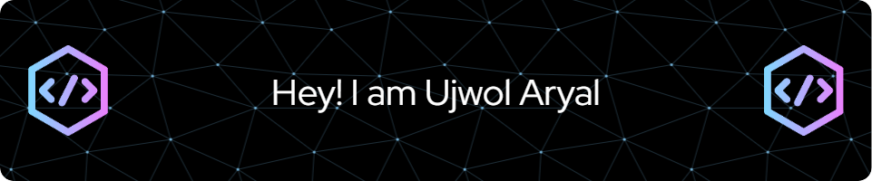

  

  
  

---

## 🧑‍💻 About Me

🎯 Innovative, passionate, and detail-oriented IT enthusiast with a solid foundation in software and web development.  
🚀 Experienced in aligning modern tech solutions with real-world business needs.  
🔧 Always eager to learn, build, and solve meaningful problems with code.

---

## 🛠️ Tech Stack

  
  
  
  
  

  
  
  

  
  
  

  
  
  
  

---

## 🚀 Projects

- 🛒 **E-commerce Platform** — MERN Stack
- 📝 **To-Do List App** — React
- 🍔 **Food Delivery WebApp** — MERN Stack
- 📄 **CV Maker** — PHP
- 🧩 **Interactive Form Builder** — React

---

## 📊 GitHub Stats

  

  

  

---

## 📈 Contribution Graph

  

---

  

---

## 📬 Connect with Me

  
  
  
  
  

